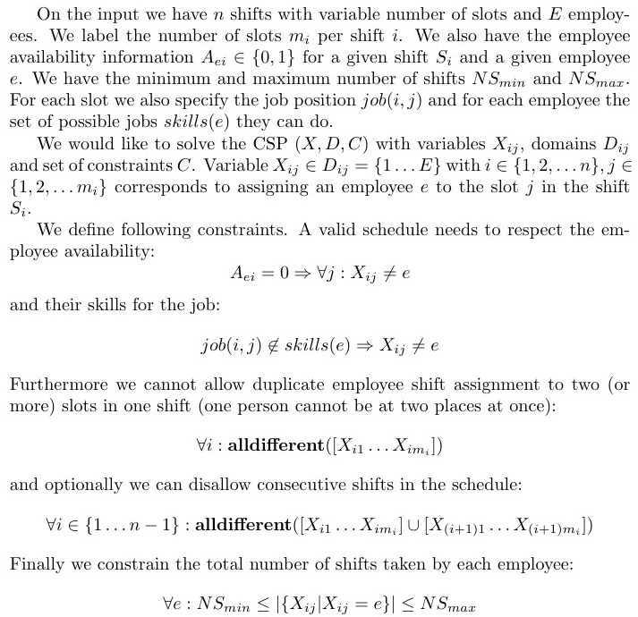

# Shift Schedule
A tool for scheduling work shifts (for example in a cafe). Programmed using Constraint Programming in SICStus Prolog. 

## Description of the problem

We would like to create a monthly schedule for part-time employees in a café. One month is divided into shifts and each shift has several slots for the employees. The number of slots per shift can be adjusted because some shifts require more workers to be present. The schedule should allocate each worker the requested number of shifts while respecting their availability for the job. Each worker also has an individual skillset (a cook cannot operate the coffee machine and vice versa). The slots can be therefore occupied only by workers with relevant skills. Lastly we would like to constrain the schedule so that no worker works two shifts in a row.

## Formal description

## Usage

## Examples

## Resources used

[Constraint Programming at MFF UK](http://ktiml.mff.cuni.cz/~bartak/podminky)
[CLP(FD) Constraint Logic Programming over Finite Domains](http://www.pathwayslms.com/swipltuts/clpfd/clpfd.html)
[SICStus Prolog manual ver. 4.3.2.](https://sicstus.sics.se/sicstus/docs/4.3.2/html/sicstus/)
